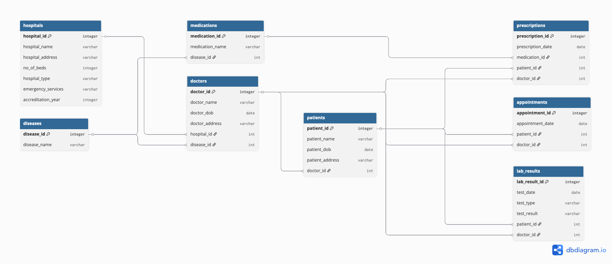

# HPDM172_assignment

This repository contains code to create and query a synthetic health data science database, `hospitals_db`, using MySQL.

- The directory [`data_generation/` ](https://github.com/Raiet-Bekirov/HPDM172_assignment/tree/main/data_generation) contains R and bash scripts for generating data to import into the database, along with the resulting plain text data files.
- The directory [`sql_queries/`](https://github.com/Raiet-Bekirov/HPDM172_assignment/tree/main/sql_queries) contains SQL script files for querying the database and documentation explaining how to use these files.
- The directory [`TeamPortfolio/`](https://github.com/Raiet-Bekirov/HPDM172_assignment/tree/main/TeamPortfolio) contains documents relating to our development process.
- The scripts [`fetch_data_files.sh`](https://github.com/Raiet-Bekirov/HPDM172_assignment/blob/main/fetch_data_files.sh) and [`generate_db_from_data_files.sql`](https://github.com/Raiet-Bekirov/HPDM172_assignment/blob/main/generate_db_from_data_files.sql) automate the process of creating `hospitals_db` from the data files provided in this repository.
- The SQL file [`hospitals_db.sql`](https://github.com/Raiet-Bekirov/HPDM172_assignment/blob/main/hospitals_db.sql) is a backup of `hospitals_db` created using `mysqldump`.

## Steps to Reproduce `hospitals_db`

Any MySQL user can duplicate our database, `hospitals_db`, using the data files and code provided in this repository. The steps to achieve this in three different ways are detailed below, in increasing order of the amount of user input required.

- [Option 1: Restore the database from the provided backup file](#option-1-restore-the-database-from-the-provided-backup-file)
- [Option 2: Use the provided scripts to download the data files and create the database](#option-2-use-the-provided-scripts-to-download-the-data-files-and-create-the-database)
- [Option 3: Download the data files and create the database from scratch](#option-3-download-the-data-files-and-create-the-database-from-scratch)

Following these steps results in the creation of a MySQL relational database, with relationships between tables that correspond with those represented in the entity relationship diagram shown below.



We also provide instructions for [exporting](#exporting-the-database) and [wiping](#wiping-the-database) the database once it is created.

### Option 1: Restore the database from the provided backup file

Make a directory to store the backup file, for example:

```shell
mkdir hosp_database
```

Navigate to the created directory:

```shell
cd hosp_database
```

Download the backup .sql file from GitHub:

```shell
wget https://raw.githubusercontent.com/Raiet-Bekirov/HPDM172_assignment/refs/heads/main/hospitals_db.sql
```

Log on to a MySQL server (in the command below, replace `<USER-NAME>` with the appropriate MySQL server username):

```shell
mysql -u <USER-NAME> -p
```

Create a new database:

```sql
CREATE DATABASE hospitals_db;
```

Quit MySQL:

```sql
quit
```

Restore the database from `hospitals_db.sql` (in the command below, replace `<USER-NAME>` with the appropriate MySQL server username):

```shell
mysql -u <USER-NAME> -p hospitals_db < hospitals_db.sql
```

The database should now be ready for use. See the [`sql_queries/`](https://github.com/Raiet-Bekirov/HPDM172_assignment/tree/main/sql_queries) directory for SQL scripts that can be used to extract useful information from `hospitals_db`.

### Option 2: Use the provided scripts to download the data files and create the database

Make a directory to store the scripts and data files, for example:

```shell
mkdir hosp_database
```

Navigate to the created directory:

```shell
cd hosp_database
```

Download the `fetch_data_files.sh` bash script from GitHub:

```
wget https://raw.githubusercontent.com/Raiet-Bekirov/HPDM172_assignment/refs/heads/main/fetch_data_files.sh
```

Modify the permissions of the bash script:

```shell
chmod u=rwx fetch_data_files.sh
```

Run the bash script to download the required data files:

```shell
./fetch_data_files.sh
```

Download the `generate_db_from_data_files.sql` SQL script from GitHub:

```shell
wget https://raw.githubusercontent.com/Raiet-Bekirov/HPDM172_assignment/refs/heads/main/generate_db_from_data_files.sql
```

Log on to a MySQL server (in the command below, replace `<USER-NAME>` with the appropriate MySQL server username):

```shell
mysql --local-infile=1 -u <USER-NAME> -p
```

Execute the SQL script:

```sql
source generate_db_from_data_files.sql
```

The database should now be ready for use. See the [`sql_queries/`](https://github.com/Raiet-Bekirov/HPDM172_assignment/tree/main/sql_queries) directory for SQL scripts that can be used to extract useful information from `hospitals_db`.

### Option 3: Download the data files and create the database from scratch

Make a directory to store input data, for example:

```shell
mkdir hosp_database
```

Navigate to the created directory:

```shell
cd hosp_database
```

Download the input data .zip file from GitHub:

```shell
wget https://github.com/Raiet-Bekirov/HPDM172_assignment/raw/refs/heads/main/data_generation/generated_data/all_data.zip
```

Unzip `all_data.zip` and place contents into a new `data/` directory:

```shell
unzip all_data.zip -d data
```

Log on to a MySQL server (in the command below, replace `<USER-NAME>` with the appropriate MySQL server username):

```shell
mysql --local-infile=1 -u <USER-NAME> -p
```

Create a new database:

```sql
CREATE DATABASE hospitals_db;
```

Switch to `hospitals_db`:

```sql
USE hospitals_db;
```

Create a `hospitals` table:

```sql
CREATE TABLE hospitals(
	hospital_id INT PRIMARY KEY,
	hospital_name VARCHAR(150),
	hospital_address VARCHAR(150),
	no_of_beds INT,
	hospital_type ENUM('General', 'Specialist', 'Teaching'),
	emergency_services ENUM('Yes', 'No'),
	accreditation_year INT
);
```

Load data from `hospitals_table.txt`:

```sql
LOAD DATA LOCAL INFILE
'data/hospitals_table.txt'
INTO TABLE hospitals
FIELDS TERMINATED BY '\t'
LINES TERMINATED BY '\n'
IGNORE 1 LINES;
```

Create a `diseases` table:

```sql
CREATE TABLE diseases(
	disease_id INT PRIMARY KEY,
	disease_name VARCHAR(150)
);
```

Load data from `diseases_table.txt`:

```sql
LOAD DATA LOCAL INFILE
'data/diseases_table.txt'
INTO TABLE diseases
FIELDS TERMINATED BY '\t'
LINES TERMINATED BY '\n'
IGNORE 1 LINES;
```

Create a `doctors` table:

```sql
CREATE TABLE doctors(
	doctor_id INT PRIMARY KEY,
	doctor_name VARCHAR(150),
	doctor_dob DATE,
	doctor_address VARCHAR(150),
	hospital_id INT,
	disease_id INT,
	FOREIGN KEY (hospital_id) REFERENCES hospitals(hospital_id),
	FOREIGN KEY (disease_id) REFERENCES diseases(disease_id)
);
```

Load data from `doctors_table.txt`:

```sql
LOAD DATA LOCAL INFILE
'data/doctors_table.txt'
INTO TABLE doctors
FIELDS TERMINATED BY '\t'
LINES TERMINATED BY '\n'
IGNORE 1 LINES;
```

Create a `patients` table:

```sql
CREATE TABLE patients(
	patient_id INT PRIMARY KEY,
	patient_name VARCHAR(150),
	patient_dob DATE,
	patient_address VARCHAR(150),
	doctor_id INT,
	FOREIGN KEY (doctor_id) REFERENCES doctors(doctor_id)
);
```

Load data from `patients_table.txt`:

```sql
LOAD DATA LOCAL INFILE
'data/patients_table.txt'
INTO TABLE patients
FIELDS TERMINATED BY '\t'
LINES TERMINATED BY '\n'
IGNORE 1 LINES;
```

Create a `medications` table:

```sql
CREATE TABLE medications(
	medication_id INT PRIMARY KEY,
	medication_name VARCHAR(150),
	disease_id INT,
	FOREIGN KEY (disease_id) REFERENCES diseases(disease_id)
);
```

Load data from `medications_table.txt`:

```sql
LOAD DATA LOCAL INFILE
'data/medications_table.txt'
INTO TABLE medications
FIELDS TERMINATED BY '\t'
LINES TERMINATED BY '\n'
IGNORE 1 LINES;
```

Create a `prescriptions` table:

```sql
CREATE TABLE prescriptions(
	prescription_id INT PRIMARY KEY,
	prescription_date DATE,
	medication_id INT,
	patient_id INT,
	doctor_id INT,
	FOREIGN KEY (medication_id) REFERENCES medications(medication_id),
	FOREIGN KEY (patient_id) REFERENCES patients(patient_id),
	FOREIGN KEY (doctor_id) REFERENCES doctors(doctor_id)
);
```

Load data from `prescriptions_table.txt`:

```sql
LOAD DATA LOCAL INFILE
'data/prescriptions_table.txt'
INTO TABLE prescriptions
FIELDS TERMINATED BY '\t'
LINES TERMINATED BY '\n'
IGNORE 1 LINES;
```

Create an `appointments` table:

```sql
CREATE TABLE appointments(
	appointment_id INT PRIMARY KEY,
	appointment_date DATE,
	patient_id INT,
	doctor_id INT,
	FOREIGN KEY (patient_id) REFERENCES patients(patient_id),
	FOREIGN KEY (doctor_id) REFERENCES doctors(doctor_id)
);
```

Load data from `appointments_table.txt`:

```sql
LOAD DATA LOCAL INFILE
'data/appointments_table.txt'
INTO TABLE appointments
FIELDS TERMINATED BY '\t'
LINES TERMINATED BY '\n'
IGNORE 1 LINES;
```

Create a `lab_results` table:

```sql
CREATE TABLE lab_results(
	lab_result_id INT PRIMARY KEY,
	test_date DATE,
	test_type VARCHAR(150),
	test_result VARCHAR(150),
	patient_id INT,
	doctor_id INT,
	FOREIGN KEY (patient_id) REFERENCES patients(patient_id),
	FOREIGN KEY (doctor_id) REFERENCES doctors(doctor_id)
);
```

Load data from `lab_results_table.txt`:

```sql
LOAD DATA LOCAL INFILE
'data/lab_results_table.txt'
INTO TABLE lab_results
FIELDS TERMINATED BY '\t'
LINES TERMINATED BY '\n'
IGNORE 1 LINES;
```

The database should now be ready for use. See the [`sql_queries/`](https://github.com/Raiet-Bekirov/HPDM172_assignment/tree/main/sql_queries) directory for SQL scripts that can be used to extract useful information from `hospitals_db`.

## Exporting the Database

To backup `hospitals_db` to a .sql file, first quit MySQL:

```sql
quit
```

Then use `mysqldump` to export the `hospitals_db` database (in the command below, replace `<USER-NAME>` with the appropriate MySQL server username):

```shell
mysqldump -u <USER-NAME> -p hospitals_db > hospitals_db.sql
```

## Wiping the Database

The following SQL statement can be used to delete the `hospitals_db` database:

```sql
DROP DATABASE hospitals_db;
```
